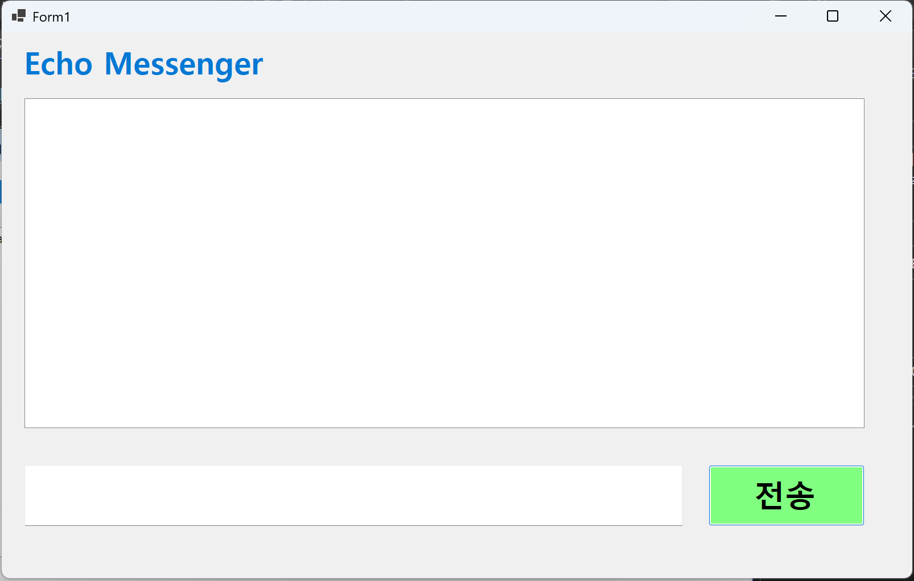
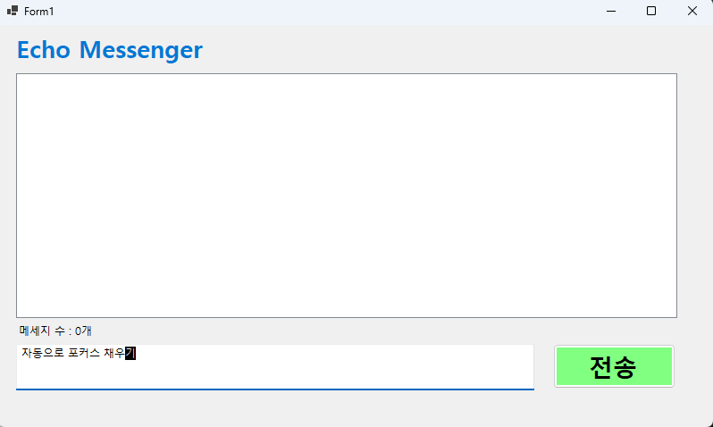
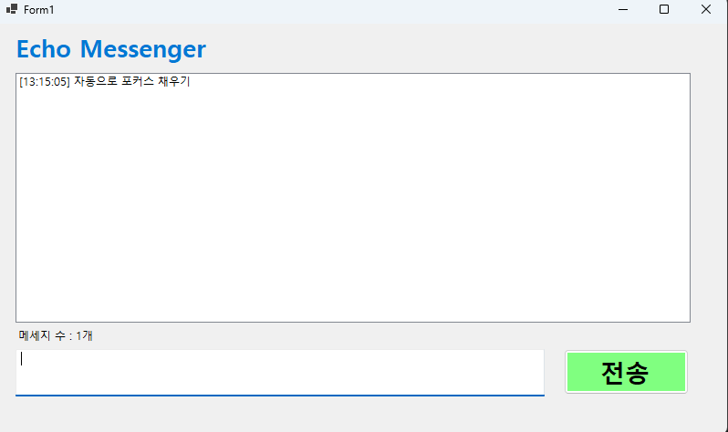
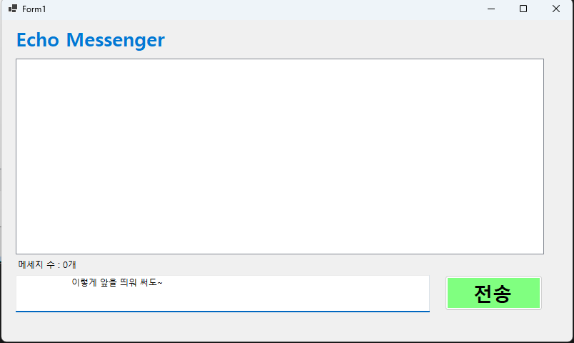
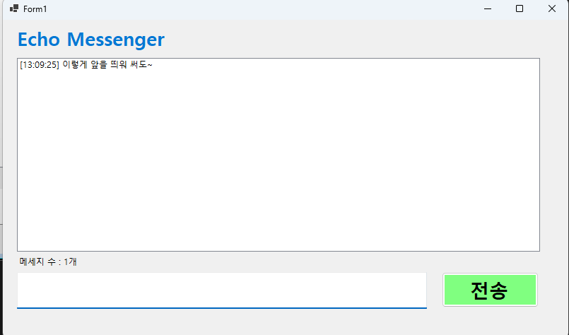
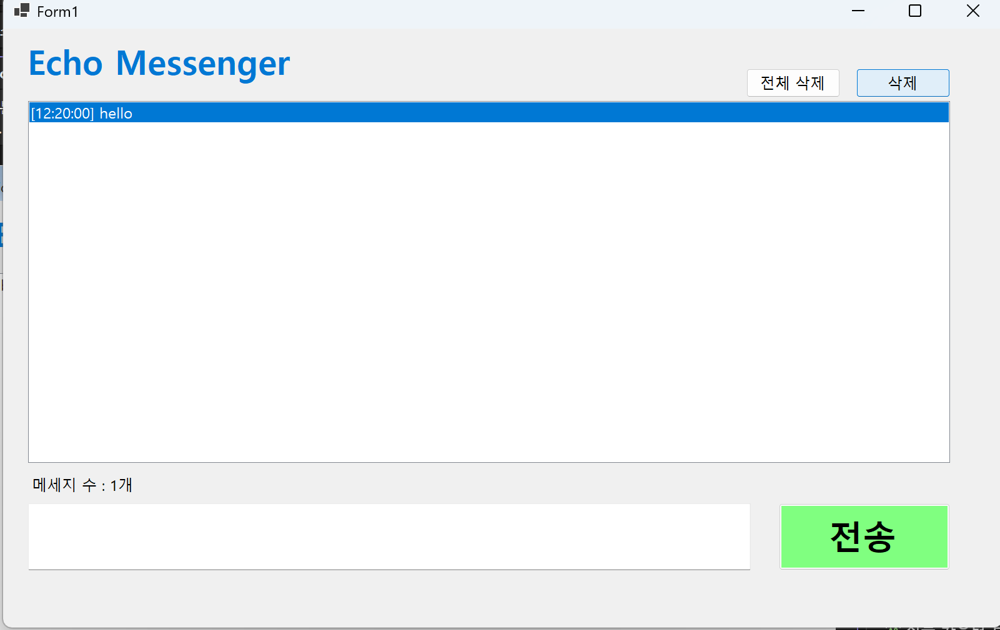
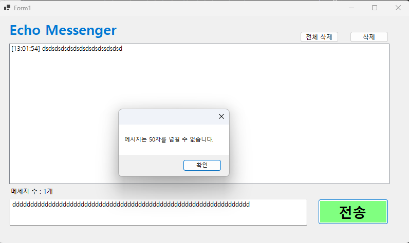

# (C# 코딩) 에코 메신저

## 개요

- C# 프로그래밍 학습
- 1줄 소개: 사용자로부터 입력받은 메시지를 시간과 함께 리스트박스에 출력하고, 개별 삭제 및 전체 삭제 기능을 제공하는 프로그램
- 사용한 플랫폼 :
  - C#, .NET Windows Forms, Visual Studio, GitHub
- 사용한 컨트롤:
  - Label, TextBox, ListBox, Button
- 사용한 기술과 구현한 기능:
  - Visual Studio를 이용하여 UI 디자인
  - string 클래스와 Item매서드를 이용해 입력된 텍스트 처리 및 보관
  - DateTime 클래스로 현재 시간 가져오기
  - Trim() 메서드로 입력값의 앞뒤 공백 제거
  - 이벤트를 이용한 버튼 클릭 및 키 입력 처리
  - ListBox를 이용한 메시지 목록 관리
  - NullOrWhiteSpace() 메서드로 빈 메시지 방지
  - length 속성으로 글자 수 제한 및 경고 메시지 표시 

## 실행 화면 (과제1)

- 과제1 코드의 실행 스크린샷  
  

- 과제 내용
  - Label (표시), TextBox(입력), Button(전송), ListBox(대화창)를 적절히 배치합니다.
  - 전송 버튼 클릭 시 TextBox의 텍스트를 ListBox의 항목(Items)으로 추가합니다.
  - 추가 직후 TextBox의 내용을 비워(Clear) 다음 입력을 준비합니다.

- 구현 내용과 기능 설명
  - Label, TextBox, Button, ListBox를 폼에 배치하여 기본 UI를 구성했다.
   사용한 코드:   
   `InitializeComponent();`
  - 입력창에 메시지를 입력하고 전송 버튼을 누르면 메시지가 리스트 박스에 표시된다.  
   사용한 코드:  
   `lbChatLog.Items.Add(txtMessege.Text);`
  - 메시지를 보낸 후 입력창을 비워 다음 메시지를 입력할 수 있게 했다.  
   사용한 코드:  
   `txtMessege.Clear();`
  - 메시지가 많아지면 자동으로 스크롤이 생겨 편하게 볼 수 있다. (ListBox 기본 기능)
## 실행 화면 (과제2)

- 과제2 코드의 실행 스크린샷  
       
  

- 과제 내용
  - 입력창의 기존 메시지 지우기
  - 입력창에 입력 포커스 갖다 놓기
  - 엔터키로 메시지 전송하기
  - 입력 방어 (빈 메시지 전송 방지)

- 구현 내용과 기능 설명
  - 전송 후 입력창의 기존 메시지가 자동으로 지워지도록 구현됨.  
    사용한 코드:  
    `txtMessege.Clear(); // 입력창 초기화`

  - 메시지 전송 후 입력창에 자동으로 포커스가 이동되도록 구현됨.  
    사용한 코드:  
    `txtMessege.Focus(); // 입력창에 포커스 설정`

  - Enter 키를 눌러도 메시지가 전송되도록 구현됨.  
    사용한 코드:  
    `if (e.KeyCode == Keys.Enter) { Send.PerformClick(); }`

  - 공백 또는 빈 문자열일 경우 메시지가 전송되지 않도록 방어 로직이 적용됨.  
    사용한 코드:  
    `if (!string.IsNullOrWhiteSpace(txtMessege.Text)) { // 메시지 전송 처리 }`

 ## 실행 화면 (과제3)

- 과제3 코드의 실행 스크린샷  
       
  

- 과제 내용
  - 메시지 앞에 현재 시간(타임스탬프)을 자동으로 붙여 출력
  - 현재까지 입력된 메시지 개수를 Label에 실시간으로 표시합니다.
  - 사용자가 입력한 메시지의 앞뒤 공백을 Trim()으로 제거하여 저장합니다.
- 구현 내용과 기능 설명
  - 메시지 앞에 현재 시간이 자동으로 붙는다.  
   사용한 코드:  
   `string timeStamp = DateTime.Now.ToString("HH:mm:ss");`
  - 메시지 개수를 Label에 표시한다.  
   사용한 코드:  
   `lblCount.Text = $"메세지 수 : {ChatLog.Items.Count}개";`
  - Trim()으로 앞뒤 공백을 제거해 깔끔한 메시지를 만든다.  
   사용한 코드:  
   `string TrimMessage = txtMessage.Text.Trim();`

## 실행 화면 (과제4)

- 과제4 코드의 실행 스크린샷  
        
  

- 과제 내용
  - ListBox에서 선택한 항목만 삭제하는 기능을 구현한다.
  - '전체 삭제’ 버튼을 클릭하면 ListBox의 모든 메시지를 한 번에 초기화한다.
  - 입력창(TextBox)의 글자 수를 50자로 제한하고,초과 입력 시 경고 메시지를 띄우거나 전송을 차단한다.

- 구현 내용과 기능 설명
  - 선택한 메시지를 삭제할 수 있다.  
   사용한 코드:  
   `lbChatLog.Items.RemoveAt(ChatLog.SelectedIndex);`))
  - 전체 메시지를 한 번에 삭제할 수 있다.  
    사용한 코드:  
    `lbChatLog.Items.Clear();`
  - 입력창 글자 수를 50자로 제한하고 초과 시 경고 메시지를 띄운다.  
    사용한 코드:  
    `if (txtMessege.Text.Length > 50) { MessegeBox.Show("50자 제한"); }`

---
## 💡 어려웠던 점 및 배운 내용 (회고)

### 1. 이벤트 처리와 메서드 재사용
* **어려웠던 점**: 메시지 전송 기능을 '전송 버튼 클릭'과 'Enter 키 입력' 두 곳에서 모두 작동시켜야 했습니다. 처음에는 동일한 코드를 두 번 작성해야 하는지 고민되었습니다.
* **해결 방안**: `btnSend.PerformClick();` 메서드를 활용하여 Enter 키가 눌렸을 때 전송 버튼의 클릭 이벤트를 강제로 호출하는 방식을 사용했습니다. 이를 통해 코드의 중복을 줄이고 유지보수성을 높이는 방법을 배웠습니다.

